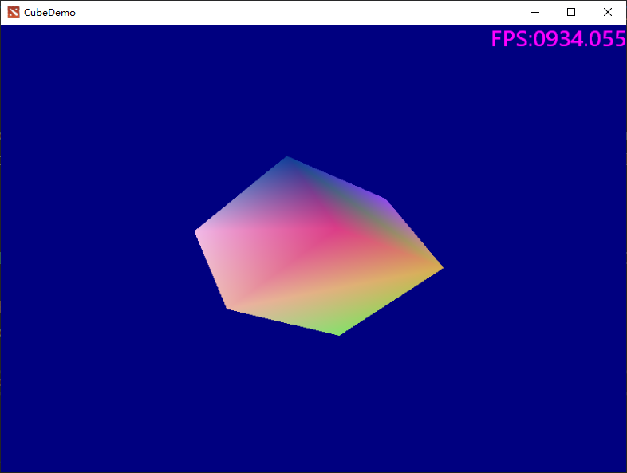
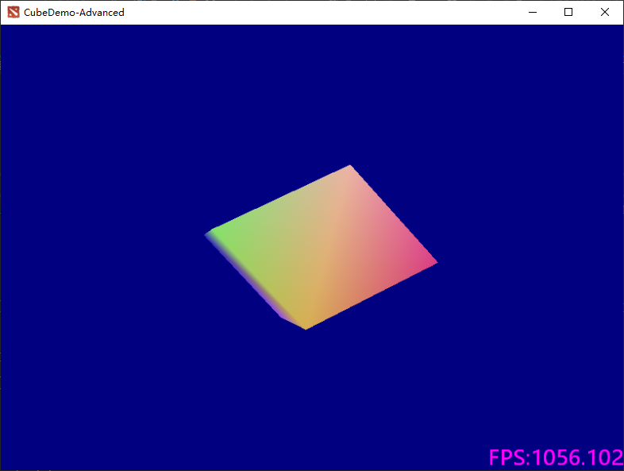
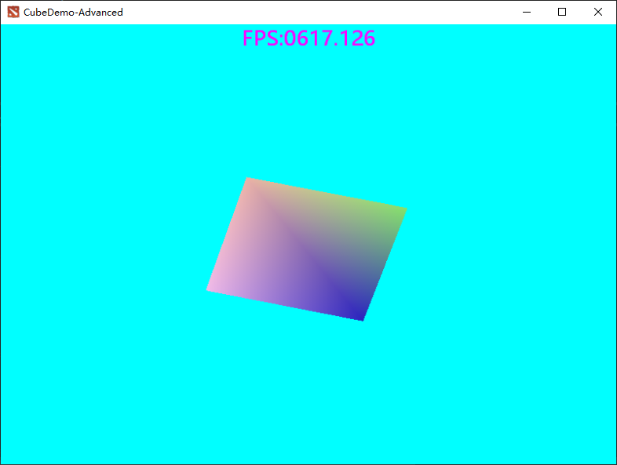
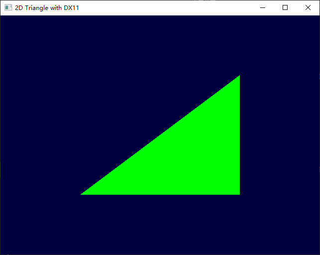

# Learning DirectX

A tour of DirectX (C++), demos and examples.

**D3D9.StarterDemo**

Very simple demo with  DirectX9

**D3D9.CubeDemo**

Cube and WinSound.

**D3D9.CubeDemo.IrrKlang**

Cube and IrrKlang.

**D3D9.CubeDemo.IrrKlang.V2**

Cube and IrrKlang, almost same as previous one.

**D3D11.TriangleDemo**

2D triangle with DirectX11.

